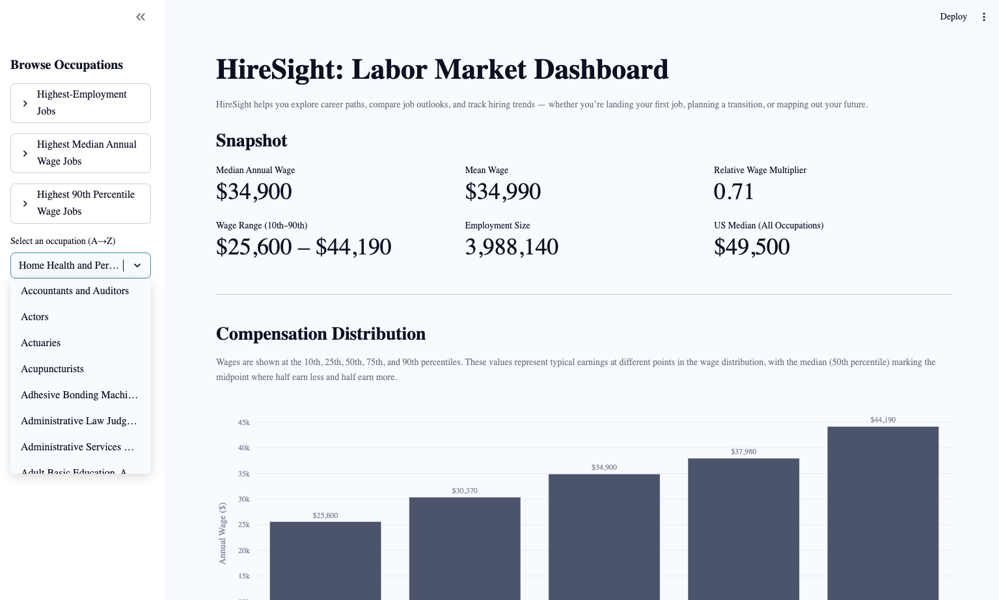
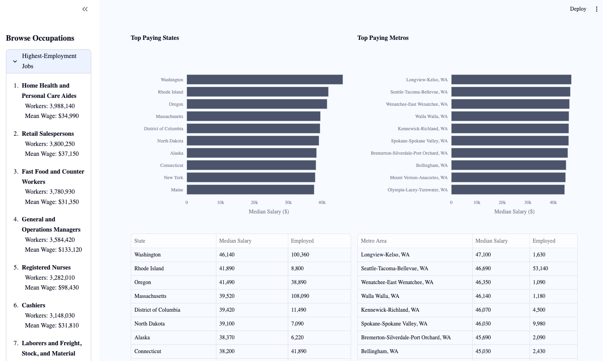
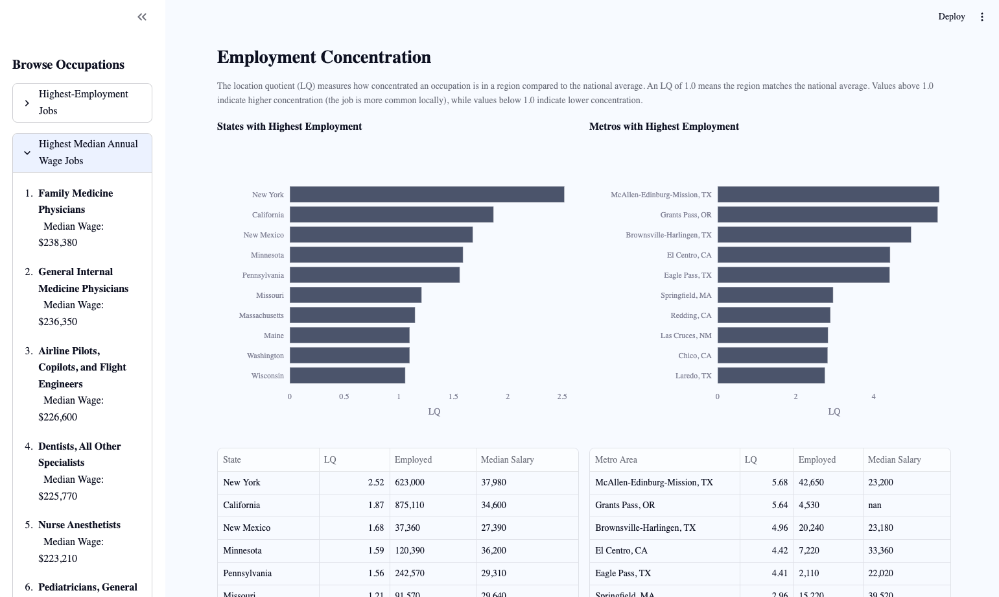

# 📊 HireSight — Labor Market Dashboard

---

Explore U.S. jobs with real BLS data.  
HireSight shows wages, employment size, geography, and industry mix for every occupation.  
Built with **Streamlit, pandas, and Plotly**.

---

## Features

- Browse jobs by **Most Popular** or **A→Z list**  
- **Snapshot**: median wage, wage range (P10–P90), mean wage, employment size  
- **Compensation Distribution**: interactive wage percentiles chart  
- **Top States / Metros**: highest-paying geographies  
- **Employment Concentration (LQ)**: where jobs are most concentrated  
- **Industry Mix**: which industries employ the occupation  

---

## 🚀 Live App

👉 [Launch HireSight on Streamlit](https://hiresight---labor-market-dashboard-hahkxkhdrzmhzxzrztzm7b.streamlit.app/)

---

## 📸 Screenshots

### Snapshot Overview
Visual summary of an occupation’s median wage, wage range (P10–P90), employment size, and comparison to the U.S. median.  

### Top States & Metros
Highest-paying states and metro areas for the selected occupation, shown with sortable tables and bar charts.  

### Employment Concentration
Location quotient analysis showing where an occupation is most concentrated relative to the national average.  

### Industry Mix
Breakdown of employment share by industry sector, highlighting which sectors employ the largest share of workers in the occupation.  

